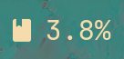
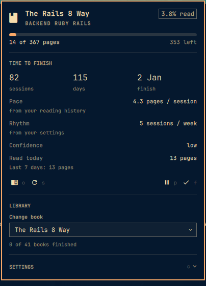
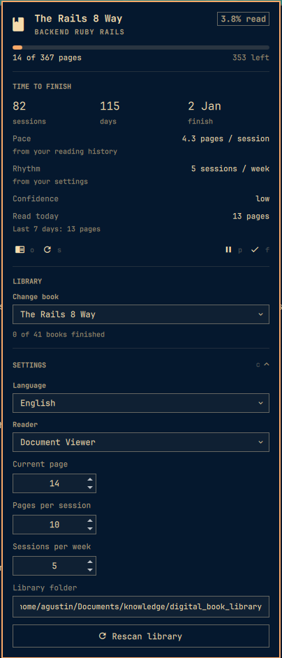
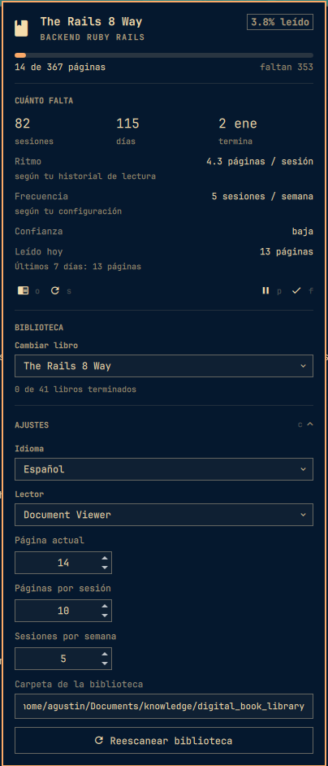

# Bookflow

Reading tracker for the [Omarchy](https://omarchy.org) bar. It answers the two
questions you actually ask mid-book — *how much is left?* and *when will I be
done?* — without asking you to log anything.

The page you are on is read straight from your document viewer. Evince (GNOME
"Document Viewer") saves the last page of every file it opens as a gvfs
metadata attribute; Bookflow polls that attribute, so turning a page in the
reader is the only bookkeeping there is.

<p align="center">
  
</p>

## What it shows

- Current book, progress bar, `page X of Y` and pages left.
- Sessions and days to finish, plus the projected finish date.
- Reading pace and rhythm, learned from your own session history once there is
  enough of it and falling back to your configured numbers before that.
- A searchable picker over your library to switch the current book.
- A brief flourish in the bar when a book is finished — the only moment the
  widget asks for attention.
- Finished books stay finished. Going back to look a page up does not touch
  what you read; a **Read again** button is there when you really are re-reading.

<p align="center">
  
</p>

Every figure says where it came from. Pace and rhythm are labelled *from your
reading history* or *from your settings*, so an estimate built on a default
never reads like one built on measurement.

## Install

```bash
omarchy plugin add https://github.com/agusherrera99/omarchy-bookflow.git --enable
```

Or by hand:

```bash
git clone https://github.com/agusherrera99/omarchy-bookflow.git \
  ~/.config/omarchy/plugins/io.github.agusherrera99.bookflow
omarchy-shell shell rescanPlugins
omarchy plugin enable io.github.agusherrera99.bookflow
```

Then point it at your books in the panel's **Settings → Library folder** and hit
**Rescan library**. Books are discovered recursively; the first directory level
becomes the book's collection, and a `NN_` prefix on it sets reading priority.

Requires `python3`, `gio` (glib2), and `pdfinfo` (poppler) — all of which a
stock Omarchy install already has. Nothing is installed outside the plugin
directory, no hooks run, and nothing is written as root.

## Remove

```bash
omarchy plugin remove io.github.agusherrera99.bookflow
```

That takes the widget out of your bar and deletes the plugin directory. It
leaves your reading history alone, so reinstalling picks up where you left off.
The history is one file, and deleting it is the last step if you want no trace:

```bash
rm -rf ~/.local/share/bookflow
```

Bookflow writes nothing else: no dotfiles, no services, no autostart entries,
and no changes to your books. Enabling and disabling edit only the plugin's own
entry in `~/.config/omarchy/shell.json`, through `omarchy plugin`.

## Bar widget

| Interaction | Action |
|---|---|
| Left click | Open the panel |
| Right click | Open the current book in your reader |
| Middle click | Capture the page now |

## Keyboard

The panel is fully keyboard-driven, and it tells you so itself: each action
carries its key as a dim letter beside the icon, so the shortcuts are there
when you look for them and out of the way when you are not.

| Key | Action |
|---|---|
| `o` | Open the current book |
| `s` | Capture the page now |
| `p` | Pause the book |
| `f` | Mark it finished |
| `r` | Read the current book again, when it is finished |
| `c` | Show or hide settings (`,` works too) |
| `↑` `↓` | Scroll |
| `Tab` | Move to the next bar panel |
| `Esc` | Close |

## Readers

| Reader | Page capture |
|---|---|
| Evince / Papers / Xreader / Atril | automatic, via gvfs metadata |
| Zathura | automatic, via its history file |
| Okular | automatic, via its docdata |
| Foliate, Calibre, MuPDF | manual — set the page in Settings |

EPUB files have no fixed pages, so their length is estimated from word count and
progress is tracked in those estimated pages.

## Settings

Language (English or Spanish), your preferred reader, the library folder, and
the pace numbers the estimate falls back to all live in the panel. Changing the
language takes effect immediately — no restart.

<p align="center">
  
  
</p>

## Data

Everything lives in one SQLite file at
`~/.local/share/bookflow/library.sqlite3`. The `bin/bookflow` CLI that the panel
drives is a normal command you can run yourself:

```bash
bin/bookflow status          # progress and estimate
bin/bookflow books           # the library with ids
bin/bookflow select 12       # set the current book
bin/bookflow sync            # capture the page now
bin/bookflow prefs --set language=es
```

Add `--json` to any of them for machine-readable output.

## Internals

`ARCHITECTURE.md` explains how the plugin is put together — the CLI/QML split,
the reader-adapter table, how sessions are detected without watching a process,
and the shell-restart quirk you will hit the first time you edit the QML.

## License

MIT
